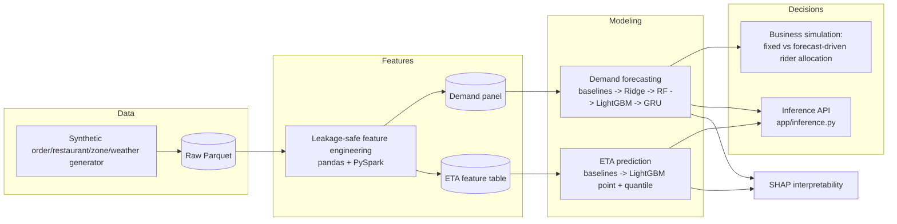

# Food Delivery Demand Forecasting & ETA Prediction

An end-to-end ML system that simulates a Swiggy-style applied data science
problem: forecasting order demand for rider/capacity planning, predicting
per-order delivery ETA with uncertainty, and measuring whether better
forecasts actually improve operations.

> **Data note:** no real Swiggy dataset is used. This project runs on a
> clearly documented **synthetic** dataset built to have realistic
> statistical structure (seasonality, peaks, distance/traffic-driven ETA).
> See [`data/README.md`](data/README.md) for the full rationale, and
> [`reports/model_report.md`](reports/model_report.md) §11 for how that
> affects how the results should be read.

## Problem

A food-delivery platform needs to answer three connected questions:

1. **How many orders will this restaurant/zone get in the next 30 min / 1h /
   2h / 6h / next day?** → drives rider capacity and staffing decisions.
2. **How long will this specific order take to deliver, with what
   confidence?** → drives the customer-facing ETA and rider dispatch.
3. **Does a better forecast actually improve operations?** → the business
   case for building 1 and 2 at all.

## Why this matters for food delivery

Under-forecasting demand leaves riders idle in the wrong zone during a spike
(late deliveries, unhappy customers); over-forecasting wastes rider-hours
that could serve another zone. A single-point ETA with no uncertainty either
overpromises (systematically late) or overpads (uncompetitive). This project
builds both pieces and connects them to a concrete operational decision
(rider allocation) via simulation, rather than stopping at model metrics.

## Architecture



Repository layout:

```
food-delivery-ml/
├── data/            raw + processed data (generated, not committed — see data/README.md)
├── notebooks/       01 data exploration -> 05 business simulation
├── src/
│   ├── data/        synthetic dataset generator
│   ├── features/    leakage-safe feature engineering (pandas)
│   ├── forecasting/ demand baselines, LightGBM/RF/Ridge, GRU, business simulation
│   ├── eta/         ETA models + quantile regression
│   ├── evaluation/  metrics, time-based splitting, SHAP interpretability
│   └── utils/       config loading
├── sql/             exploratory + feature-extraction SQL (DuckDB)
├── spark/           distributed re-implementation of the feature pipeline
├── configs/         config.yaml (single source of truth for parameters)
├── tests/           leakage-prevention unit tests
├── reports/         model_report.md + figures
└── app/             inference CLI
```

## Dataset

3,054,418 synthetic orders over 90 days, 150 restaurants across 12 zones,
~30,000 customers with Zipf-distributed repeat behavior, hourly
weather/traffic per zone including a simulated monsoon period. Generated by
[`src/data/generate_dataset.py`](src/data/generate_dataset.py) — see
[`data/README.md`](data/README.md) for the full schema and regeneration
instructions.

## Feature Engineering

Two feature tables, both leakage-safe by construction (every lag/rolling/
historical aggregate is computed on a `.shift(1)`ed series before any
aggregation — enforced by [`tests/test_feature_leakage.py`](tests/test_feature_leakage.py)):

- **Demand panel** (648K rows): temporal/cyclical encodings, multi-horizon
  lags (30m/1h/2h/1d/1w), rolling mean/std/max (2h/8h/1d), EWM, expanding
  restaurant/zone historical aggregates, current weather/traffic.
- **ETA table** (3.0M rows): distance, basket, time-of-day, restaurant
  static attributes, expanding restaurant historical prep-time/ETA behavior,
  current traffic/weather.

Full details and leakage-safety visual checks: [`notebooks/02_feature_engineering.ipynb`](notebooks/02_feature_engineering.ipynb).

## Modeling

**Demand forecasting** (5 horizons): naive/seasonal baselines → Ridge →
Random Forest → LightGBM → GRU sequence model (1h horizon only, to test
whether raw-sequence modeling beats hand-engineered lag features — see
[`src/forecasting/train_gru_demand.py`](src/forecasting/train_gru_demand.py) for the reasoning).

**ETA prediction**: mean/median/linear baselines → LightGBM point estimate →
LightGBM quantile regression (P10/P50/P90) for prediction intervals.

All models use a **time-based 70/15/15 train/val/test split** — never
shuffled — since shuffling a temporal panel lets adjacent-timestamp lag
features leak train/test information (see [`src/evaluation/metrics.py::time_based_split`](src/evaluation/metrics.py)).

## Results

### Demand forecasting (MAE, orders / 30-min bucket)

| Horizon | Best baseline | LightGBM | Improvement |
|---|---|---|---|
| 30 min | 3.033 | **2.043** | 32.6% |
| 1 hour | 3.568 | **1.812** | 49.2% |
| 2 hour | 5.193 | **1.763** | 66.0% |
| 6 hour | 6.276 | **1.639** | 73.9% |
| Next day | 2.583 | **1.831** | 29.1% |

### ETA prediction (minutes)

| Model | MAE | P90 | P95 |
|---|---|---|---|
| Median-by-zone (baseline) | 9.09 | 18.64 | 22.79 |
| **LightGBM** | **4.31** | **9.00** | **10.95** |

80% prediction interval (LightGBM quantile regression): **79.8% empirical
coverage**, mean width ≈ 13.75 minutes.

Full tables, GRU comparison, and SHAP interpretability:
[`reports/model_report.md`](reports/model_report.md), [`notebooks/03_demand_forecasting.ipynb`](notebooks/03_demand_forecasting.ipynb),
[`notebooks/04_eta_prediction.ipynb`](notebooks/04_eta_prediction.ipynb).

## Error Analysis

Both models are evaluated with per-segment breakdowns (peak/off-peak,
distance band, zone, weather condition), not just an aggregate metric — see
`error_breakdown` in [`src/evaluation/metrics.py`](src/evaluation/metrics.py)
and the corresponding notebook sections. Key finding: ETA error is stable
across most distance bands but rises for 10km+ deliveries (less training
signal for rare long-distance orders).

## Business Simulation

[`notebooks/05_business_simulation.ipynb`](notebooks/05_business_simulation.ipynb)
compares a **fixed** rider allocation (same riders every 30-min bucket)
against a **forecast-driven** allocation (same total rider-hours budget,
redistributed proportionally to the predicted demand) — see
[`src/forecasting/business_simulation.py`](src/forecasting/business_simulation.py)
for the mechanics and [`models/business_simulation_summary.json`](models/business_simulation_summary.json)
for the measured result: **total unmet demand fell 29.3%** (281,717 →
199,053 orders) and capacity utilization rose from 70.4% to 97.3%. Reported
honestly alongside a real tradeoff: the share of buckets where capacity
*fully* met demand actually dropped (46.0% → 16.4%), since allocating
tightly to the predicted mean leaves many buckets with a small shortfall
instead of a comfortable fixed cushion — see model report §8.3 and notebook
05 for the full discussion. This is a simulation with explicit caveats (no
rider shift constraints, no reallocation cost) — see the model report §11.

## Scaling with Spark

[`spark/distributed_feature_pipeline.py`](spark/distributed_feature_pipeline.py)
re-implements the core lag/rolling feature logic using Spark Window
functions, runnable locally (`local[*]`) but written the way it would run on
a cluster (explicit shuffle-partition config, zone-based repartitioning).

**Scaling this system from 1M to 1B orders:**
- **Partitioning:** partition raw/processed Parquet by date (and
  secondarily by zone) so time-bounded queries and per-zone rider-planning
  jobs prune irrelevant partitions instead of scanning everything.
- **Spark for feature computation:** the pandas pipeline works at today's
  scale but doesn't parallelize across machines; the Spark version
  (`spark/distributed_feature_pipeline.py`) is the template for a real
  multi-node feature job.
- **Feature store:** compute lag/rolling/historical features once, serve
  them consistently to both batch training and low-latency online inference
  — avoids the online/offline skew risk in the current `app/inference.py`
  simplification (which recomputes features from scratch on each call).
- **Incremental computation:** at 1B-order scale, recomputing full-history
  rolling/expanding aggregates on every run is wasteful — an incremental
  (append-only, checkpointed) aggregation strategy is needed instead of
  full recomputation.
- **Data skew:** a handful of zones/restaurants dominate order volume (see
  the zone-demand-concentration SQL query in `sql/exploratory_queries.sql`)
  — naive partitioning by `zone_id` would create hot partitions; production
  Spark jobs would need key salting for the busiest zones.
- **Caching:** cache the restaurant/zone dimension tables (small, frequently
  joined) in Spark's broadcast join mechanism rather than shuffling them
  repeatedly against the much larger orders fact table.
- **Model serving:** separate model *training* (batch, can tolerate Spark's
  higher latency) from model *serving* (needs a low-latency runtime —
  e.g. a lightweight LightGBM inference service reading pre-computed
  features from the feature store, not recomputing them per request).

## How to Run

```bash
python3 -m venv .venv && source .venv/bin/activate
pip install -r requirements.txt

# 1. Generate the synthetic raw dataset
python -m src.data.generate_dataset --out data/raw --seed 42

# 2. Build the leakage-safe feature tables
python -m src.features.build_features --raw data/raw --out data/processed

# 3. Train and evaluate demand forecasting models (all 5 horizons)
python -m src.forecasting.train_demand_models

# 4. Train and evaluate ETA models (point + quantile regression)
python -m src.eta.train_eta_models

# 5. GRU sequence model for the 1h horizon (requires torch)
python -m src.forecasting.train_gru_demand

# 6. Business simulation: fixed vs. forecast-driven rider allocation
python -m src.forecasting.business_simulation

# 7. (Optional) PySpark feature pipeline demo
python spark/distributed_feature_pipeline.py

# 8. Run the notebooks (already executed and committed with outputs)
jupyter nbconvert --to notebook --execute --inplace notebooks/*.ipynb

# 9. Run tests
pytest tests/ -v
```

## Example Inference

```bash
python -m app.inference demand --restaurant_id 5 --timestamp "2026-06-15 19:30"
```
```json
{
  "restaurant_id": 5,
  "timestamp": "2026-06-15 19:30:00",
  "bucket_ts": "2026-06-15 19:30:00",
  "forecast_30m": 4.2,
  "forecast_1h": 7.8,
  "forecast_2h": 14.1,
  "expected_peak": true
}
```

```bash
python -m app.inference eta --restaurant_id 5 --distance_km 3.2 --n_items 3 \
    --basket_value_inr 450 --timestamp "2026-06-15 19:30"
```
```json
{
  "restaurant_id": 5,
  "timestamp": "2026-06-15 19:30:00",
  "eta_minutes": 31.4,
  "lower_bound": 24.8,
  "upper_bound": 39.2
}
```

(Exact values depend on the generated data's random seed and will vary
slightly run to run since `app/inference.py` retrains on the fly — see
"Production considerations" in the model report for why that's a documented
simplification rather than a production pattern.)

## Limitations

- Synthetic data — see the data note at the top of this README and
  `reports/model_report.md` §11 for the full list (no real weather forecast,
  no rider-level dispatch simulation, no cold-start handling, simplified
  business simulation).

## Future Work

- Conformal prediction intervals for demand forecasts (currently only ETA
  has calibrated intervals).
- Hierarchical/shared-strength demand models across restaurants.
- A discrete-event rider-dispatch simulation instead of bucket-level capacity
  abstraction.
- Real weather/traffic *forecast* features (not just current conditions) for
  longer horizons.

